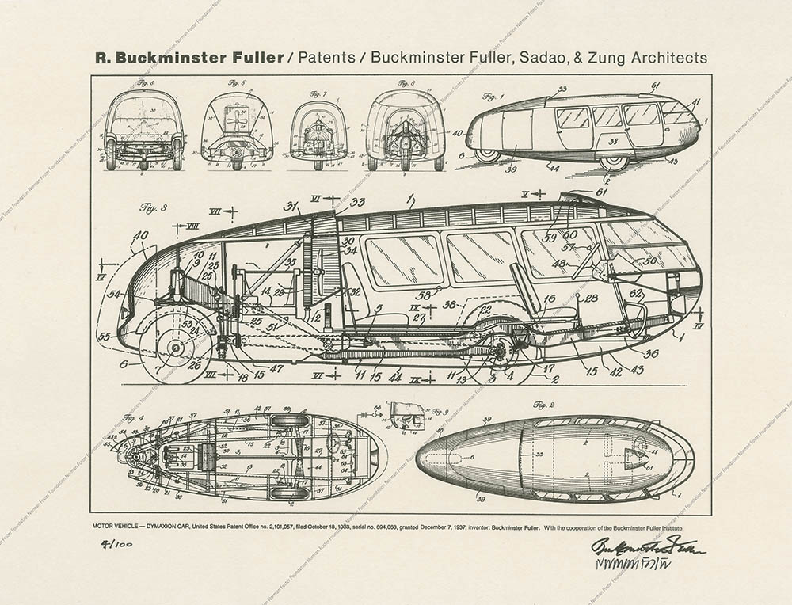

In 1933, Buckminster Fuller
along with naval architect
Starling Burgess and a team of
27 workers began production of
what Fuller believed to be a
part of the future of transport.

Bucky envisioned a vehicle that
could one day both fly and
drive, with his designs for the
car serving as an exploration
into what, as he called it, the
‘ground-taxiing phase’ of this
utopian vehicle might look like.

In yet another exhibit of his
love for portmanteau’s, he named
it - the ‘Dymaxion’ car, a
combination of the words
Dynamic, maximum, and tension.

Fullers plans for a utopian
transport vehicle centered
around his wish to do more with
less. It was his goal to design
a vehicle that was cost
efficient to both build and
fuel, all the while helping to
reduce pollution. 

These ideas were among many at the time, as
designers, architects, and
engineers alike tried to realize
their visions of a utopian
society. They were born out of
frustration with the political,
economic, and social systems of
the time – as well as a desire
for change in said systems, and
Fuller was no different,
devoting his rather tragic life
to the pursuit of a better
future.

In that spirit, the
dymaxion car would play a part
in Fullers utopian vision, but
not the one he hoped for.

Visually, the dymaxion car is
striking. Today, one might liken
it to a hyper sleek vintage VW
camper van, or perhaps a vehicle
the Thunderbirds might even use.
For the 1930’s however, its
modern look is undeniable.

The car’s large frame was not
without reason, Bucky had
designed it to seat 11 people
comfortably – perhaps with the
aim of reducing pollution in the
mind. 

This elongated and sleek
body was supported by not four,
but three wheels, with the back
wheel acting in a similar vein
to the rudder of a ship (no
doubt inspired by Bucky’s love
of sailing – and his partnership
with Burgess).

Perhaps detrimentally, this
singular wheel allowed the car
to manoeuvre itself in a way not
seen previously, by enabling the
driver to turn the wheel 90
degrees and steer the vehicle on
its axis. 

In demonstrations,
Fuller showed how this could be
used to easily parallel park the
car. However, this
unconventional design also led
to him having to conceptualize a
road system that would work for
his utopian vehicle, perhaps
contributing to its failure to
be commercially realized.

There were other factors that no
doubt contributed to this
however, one being the
controversy the project found
itself in following a crash that
resulted in the deaths of two
people, seriously injuring
others. Following this,
questions around the vehicles'
handleability began to be
raised, and Fuller and Burgess
quickly realized that their
design was not suited for
commercial adaptation.

Aside from its market failure
however, we must ask ourselves
how effective is it as a utopian
design? Well, not very. Fullers'
hyper fixation on the novelty of
having 3 wheels instead of four
created a plethora of issues
that hindered its impact and
drew attention away from its
more impactful utopian features,
such as its fuel efficiency.

In summation, while the
aesthetics of the car are
impressive and unapologetically
modern, its functionality as a
mode of transportation seems to
fall behind. Certain features
such as its ability to seat 11
passengers are impressive but
were overshadowed by its poor
handling and questions of
safety. 

When compared to his
other work such as the Geodesic dome, the dymaxion car
seems much less impressive and
significant – but still, serves as a worthwhile
exploration into what the future
of transportation could have
looked like.
