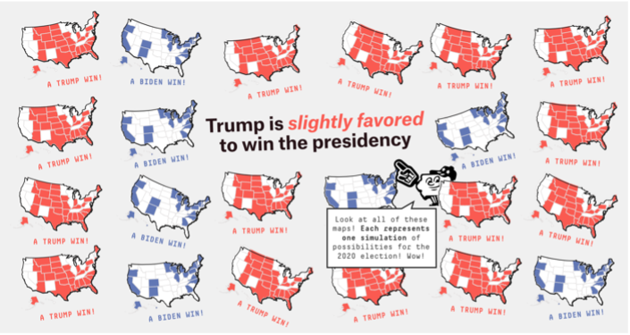
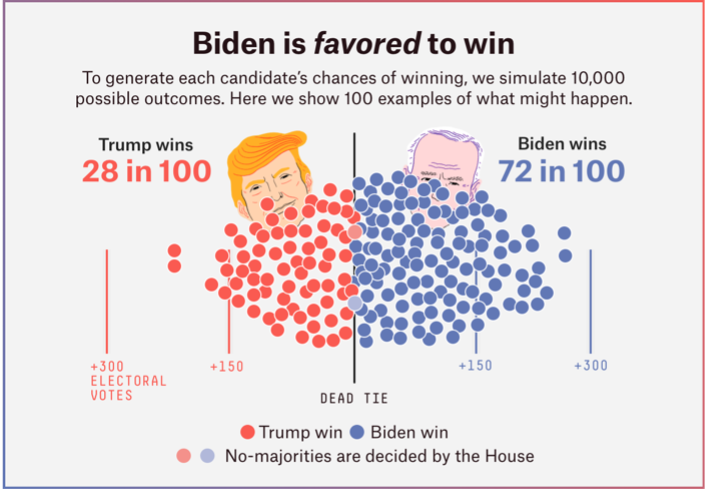
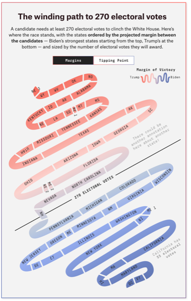
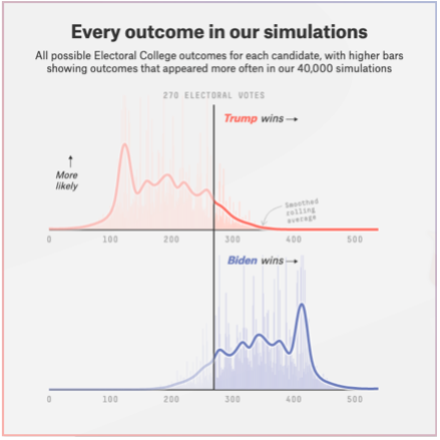

In a world of increasing complexity, the job of explaining its even more complex data through the use of effective visualizations has become a crucial one. As more and more media outlets, private companies, and indeed the public sector double down on their use of data visualization as a means to tell a story, it's important to be aware of the key ingridients that constitute an effective visualization. 

Having recently taken a course in Data Visualization at the Institute of Art Design and Technology, Dún Laoghaire, I learned that the ability to critique visualizations and analyse their strengths and weaknesses objectively was of a vital skill for anybody working in the field. As part of the course, I was tasked with critiquing two separate visualizations, one which I thought represented poor data visualization, and an other, that I thought represented effective data visualization.

When critiquing the visualizations I chose, I asked myself the following questions: 
- Who is the target audience?
- What is the core message / data story?
- How effective are the visualizations, and was the correct visualization technique chosen?
- How well is colour used? 
- Is the overall layout appropriate?
- Is there redundant information, or useful information omitted?
- How could the visualization be improved upon?

Bellow is a section of my essay written for said assignment, that answers the above questions for my choice of <em>effective</em> data visualization, [FiveThirtyEight's 2020 Elelction Forecast](https://projects.fivethirtyeight.com/2020-election-forecast/). I chose FiveThirtyEight's election forecast as I'm an admirer of their work in the field of data journalism, and I more often than not find their visualizations to be creative, and well designed. 

## Who is the target audience?

FiveThirtyEight&#39;s content varies in subject, from Major League Baseball, to public health and American politics. However, no matter the topic, telling a story with data is integral, and making it understandable through the use of suitable visualizations, even more so. Prior to each presidential election, Nate Silver and his team at FiveThirtyEight create a forecast based on aggregated polling figures. Given the nature of the subject, these forecasts have a rather broad target audience. Readers might range from your average person looking to learn more about how the election works, to political scientists – well versed in forecasting, statistics, and indeed data visualization. Either way however, each reader is more than likely a left leaning, democratic voter, given the publications stance on issues such as climate change and LGBTQ+ rights. Nonetheless, these visualizations have a lot of bases to cover.

## What is the core message / data story?

The core message the visualizations aim to convey, is that there is a myriad of ways for the election to pan out, and that it&#39;s really the states themselves that determine the probabilities, with certain &quot;swing&quot; states being pivotal in deciding the outcome. There is, however, a secondary message also present.

During the 2016 presidential election, FiveThirtyEight and their forecast were criticized heavily for failing to accurately predict the elections outcome. However, this criticism was somewhat misguided. A key thing to understand with election forecasts is that even a 1% chance is not 0%, and that although Trumps chances of winning were unlikely, it was still very much possible. As Anna Wiederkehr, a senior visual journalist at FiveThirtyEight who worked on the forecast wrote: &quot;Given the brouhaha after the 2016 election, we knew we had to thoughtfully approach _how_ we delivered the forecast.&quot; Ergo, the need to focus on the model, and help readers to understand where the numbers were coming from, became another part of the core message the visualizations needed to portray.

## How effective are the visualizations, and was the correct visualization technique chosen?

While there are a number of different visualizations present within the article, I have chosen to analyse the three which I believe portray the forecast data most successfully, and in a digestible manner.

The first visualization the user sees is a grid of maps, each showcasing a different simulated outcome, with a heading stating which candidate is currently favoured to win, along with an annotation explaining to the reader that each map represents an individual simulation. The use of a grid of maps, showcasing different possible election outcomes, serves as an excellent introduction to the article. It gives an indication of who the model _currently_ favours, showcases that there are a lot of different results possible (therefore adhering to core message of the article), and achieves the need to convey that it is states that drive the forecasts probabilities. This sets the stage for the reader effectively.

The next visualization showcases 100 possible outcomes (out of 10,000 simulations) using a beeswarm plot, with the x-axis showing the margin of votes by which the respective candidate won. The visualization is more than effective at conveying the underlying data to the user, and focuses yet again on the model itself. Employing the use of a beeswarm to visualize the data and how it is distributed aligns well with how Andy Kirk describes their use case: &#39;A beeswarm plot displays the distribution of quantitative values for data items to show the range and shape of quantities&#39;. The use of a beeswarm also allows each data point to be evenly spaced out, allowing the user to see how the election panned out in a given simulation. Hovering on a specific point displays an annotation showing a map of how each state faired, along with the total electoral college votes for each candidate. This interactivity further benefits the visualization&#39;s effectiveness in allowing the reader to understand the data, and forecast as a whole.

The final visualization is perhaps my favourite. It showcases a snake chart, where each segment of the &#39;snake&#39; represents a state or district, whose length is determined by the number of electoral college votes that state holds. Each segment is also coloured with a red/blue gradient, the saturation of which indicates how strong a given parties&#39; forecasted vote share is in that state, allowing the reader to observe which states are the most contested. The chart is separated by a line showing at what point 270 electoral college votes has been met, thus signalling the victory of a given candidate. This visualization manages to give a number of different valuable insights to the reader. It allows them to see where a given party is strongest, informs them on which states hold the most electoral college votes, and shows them which states could swing the election either way, all the while giving them a high level overview of which candidate is most likely to win. An option to view the states that hold the highest chance of being the tipping points is also provided, giving the reader an alternative way to view the data.

The chart is also interactive with the number of electoral college votes, and then predicted vote share for that state being displayed in an annotation when you hover on a segment. Clicking on a segment also allows a deeper dive into that state.

While unconventional, the creative use of a snake chart to visualize a state by state breakdown of the election is creative, clear, and visually pleasing. In a single graph, it summarises the narrative of the forecast, while allowing more focused analysis.

## How well is colour used?

As is to be expected when visualizing nominal data, the colours used in this visualization are distinct from each other, with red and blue representing the Republican and Democratic parties respectively. Less saturated tones of red and blue are used, which brings a certain softness and readability to the visualization. As aforementioned, the strength of tones is varied within the snake chart in order to show how contested a state is, an apt use of colour that is easily understood by the reader.

## Is the overall layout appropriate?

The layout is well structured, and composed in a clear and readable manner thanks to each visualization being contained within a separate card. This helps the user to focus on one visualization at a time, allowing them to gain a better understanding of the story each graphic is trying to tell, while also creating a flow of narrative. One criticism of the layout I would make, is that due to the content being centred, I found it easy to miss out on the option to view the House and Senate forecasts which sit at the top left of the page. However, I found all other interactive elements to be visually obvious. On mobile, the layout maintains its narrative and structure, with no discernible drops in the quality of the visualizations. The issue with the layout of the House and Senate forecast toggle is also solved on mobile, as they are positioned at the bottom of the screen.

## Is there redundant information, or useful information omitted?

With regards to the beeswarm, I think it would have been useful to know why out of a possible 10,000 simulations, a segment of just 100 was chosen. While I understand the need to make the chart readable and concise by not polluting it with data points, one can&#39;t help but wonder how the 100 simulations were chosen? Were they picked at random, or were they perhaps cherrypicked? Is 100 simulations representative of a much larger data set of 10,000? No doubt showcasing 100 outcomes allows the reader to intuitively convert a &quot;10 in 100&quot; chance of winning to a &quot;10%&quot; chance. However, as the article and indeed the visualization aims to focus on the model itself, some added information on how the selection of 100 simulations was decided upon would be welcomed.

One visualization however, shows a probability distribution function of all 40,000 simulations, with the height of each bar indicating how many times a given candidate won with a certain number of electoral college votes. The visualization shows two separate plots, one for Trump, and another for Biden. The use of two separate plots here is by definition redundant, as one graph is simply the inverse of the other. For example, the data could be displayed with just the top graph by colouring the bars on the left hand side of the graph blue, indicating the distribution of times Biden won, while keeping the right hand side of the plot red to show the distribution of times Trump won. However, though redundant, it can be argued that the separation of the two is efficient data visualization, as it makes the graph easier to read and understand.

## How could the visualization be improved upon?

While FiveThirtyEight&#39;s 2020 election forecast is for the most part faultless in its attempt to display forecast data, and any previously mentioned qualms could be considered pedantic, there is one improvement I would make. Despite the final visualization showing how the forecasted win chances of each candidate changed over time, there is a lack of article wide insight into how the forecast changed. While it is Nate Silver&#39;s belief that he should be judged on his final forecast, it is widely accepted amongst statisticians and forecasters alike, that he should be judged on his entire forecast and how it changed during the run up to the election. One such person that holds said opinion is Isaac Faber, Chief Data Scientist at the Army Artificial Intelligence Task Force, who writes: &quot;a prediction should be judged from the time it is given to the public and not just the moment before the event.&quot; Although the final graph addresses _part_ of this concern, I believe the visualizations could be improved upon by adding a date slider that is stuck to the top of the page that would allow users to see how each visualization looked as the forecast changed. This would be particularly useful when looking at the snake chart, where the slider would add the ability to see which states had the biggest shift in forecasted vote share.

To conclude, FiveThirtyEight&#39;s 2020 election forecast is creative, approachable, and methodical in its use of data visualization. A clear narrative is present, one that is well structured, well designed, and understandable. It provides valuable insight to both the average person, as well as those more accustomed to forecasting and American politics. Considering this, FiveThirtyEight&#39;s 2020 election forecast is a prime example of what &quot;effective&quot; data visualization looks like.

**Reference List**

Faber, I. (2020, September 30). _Why you should care about the Nate Silver vs. Nassim Taleb Twitter war_. Medium. https://towardsdatascience.com/why-you-should-care-about-the-nate-silver-vs-nassim-taleb-twitter-war-a581dce1f5fc

Kirk, A. (2019). _Data Visualisation: A Handbook for Data Driven Design_ (2nd ed.). SAGE Publications Ltd.

Wiederkehr, A. (2020, August 13). _How We Designed The Look Of Our 2020 Forecast_. FiveThirtyEight. [https://fivethirtyeight.com/features/how-we-designed-the-look-of-our-2020-forecast/](https://fivethirtyeight.com/features/how-we-designed-the-look-of-our-2020-forecast/)
