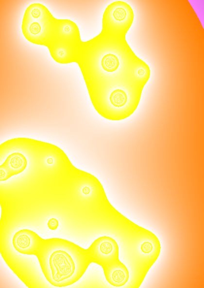

Bellow is a collection of some posters I made while exploring the possibilities of using the Processing framework to create generative art. Throughout the process, I read the documentation extensively in an effort to utilize as many different features of the framework as possible. 

This served as a great introduction to Java and indeed strongly typed languages in general, which I had never really used before.

