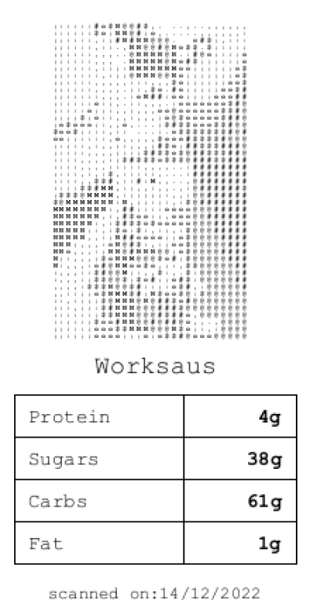
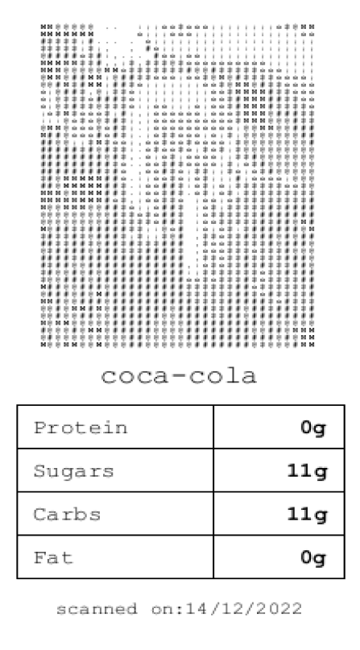

## What is Nutritimon?
Nutritimon is an alternative approach to food tracking, transforming the mundane task into an engaging and enjoyable experience. The project combines the principles of nutrition tracking with gamification, offering users a unique way to monitor their dietary habits. The core feature involves users scanning the barcodes of their food purchases, which then generates and prints physical playing cards containing each items nutritional information. The idea came from a general distaste for the user experience in apps such as MyFitnessPal and its focus on calorie counting, as well as the way in which the app is used on a purely individual level - void of any real social features. 

## How does it work from a technical standpoint?
A barcode scanner is connected to an arduino microcontroller. When an item is scanned using the scanner, its ISBN/EAN number (unique product identifier) is forwarded to an open API through the arduino to obtain its nutritional information. 
This data is then passed on to a processing script which generates a playing card for the food item, displaying the foods fat, protein, carbohydrate and sugar content per serving. Once generated, the card is printed out on a standard receipt printer.

## How is the game played?
Inspired by card games such as TopTrumps, the rules are as follows:
- To begin, players must build deck of cards out of the food they have eaten within the past week. 
- Each player begins a game with four health bars: Protein, Sugars, Carbs, and Fat – equal to 5HP each. 

- Rock paper scissors or flip a coin to decide who attacks first. 

- At the beginning of each round, each player selects a random card from their deck. The attacking player then chooses an attribute to compare. 

- If the opposing player has a higher value than the attacker, then they take 1 damage to their respective nutrient bar. If not, the turn passes. 

- Players repeat this until one of them succeeds in depleting two of their opponents nutrient bars. 

## What did I learn?
This project was a great opportunity for me to learn more about data fetching in Processing, as well as how to interface with an arduino and sensors.
My original goal with this project was to design a fully self contained device that could scan the item, fetch its nutritional info, and print out a playing card. I imagined it functioning like ["Scannerz"](https://skannerz.fandom.com/wiki/Skannerz), a toy from the early 2000's that worked with a similar concept. 

While this would no doubt be possible, difficulties present themselves with things such as internet connection and indeed fitting such a number of components into a handheld form factor.
While I loved the idea of creating a physical card game to help monitor what we eat, maybe this is the sort of idea that would work best digitally in the form of an app. Perhaps something to revisit in the future.
